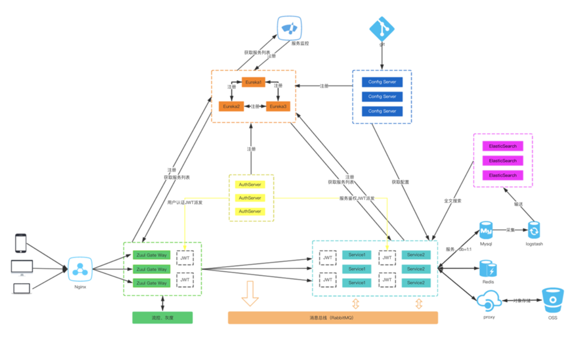

### 项目架构

## 项目LICENSE
    请遵守LICENSE开源协议
## 项目模块说明
    
    javakc
        ├── spring-cloud-core
        │   ├── spring-cloud-admin-server 微服务性能监控
        │   ├── spring-cloud-config-bus 微服务配置自动刷新
        │   ├── spring-cloud-config-server 微服务配置集中管理
        │   ├── spring-cloud-eureka-server 微服务服务端(微服务集中管理)
        │   └── spring-cloud-gateway-api 微服务网关集中拦截分发
        │
        ├── microservice-module
        │   ├──system-user(系统管理-用户模块)
        │   └──system-role(系统管理-角色模块)
        │
        ├── component-core
        │   ├──component-data-entity(公共组件-实体类)
        │   └──component-data-jpa(公共组件-JPA)
        │
        ├── db(数据库文件)
        │   ├──javakc-mysql.sql
        │   └──javakc-oracle.sql
        │
        ├── LICENSE (版权说明)
        ├── README.md (项目说明)
        └── pom.xml (maven core setting)
    
### 项目技术
    SOA服务框架 SpringFramework、SpringBoot、SpringCloud、RestFul
    分布式缓存 Redis
    模块化管理 Maven
    数据库连接池 Alibaba Druid
    核心框架 Spring Framework
    持久层框架 SpringData JPA(Hibernate)
    安全框架 SpringSecurity Oauth2
    服务端验证 Hibernate Validator
    任务调度 Quartz
    日志管理 SLF4J、Log4j
 
    
### SpringCloud
    
    Ribbon 客户端负载均衡，特性有区域亲和、重试机制
        已添加
    Hystrix 客户端容错保护，特性有服务降级、服务熔断、请求缓存、请求合并、依赖隔离
        已添加
    Feign 声明式服务调用，本质上就是Ribbon+Hystrix
        已添加
    Bus 消息总线，配合Config仓库修改的一种Stream实现
        已添加    
    Rabbitmq 基于消息发布/订阅模式实现的消息系统
        已添加
    Config 统一服务配置信息
        已添加
    Gateway 路由转发、权重路由、断路器、限流、鉴权和黑白名单等
        完善中...
    Sleuth 分布式服务追踪，需要搞清楚TraceID和SpanID以及抽样，如何与ELK整合。
        待添加...
    Stream 消息驱动，有Sink、Source、Processor三种通道，特性有订阅发布、消费组、消息分区
        待添加...
        
## 项目路径描述
##### spring-cloud-eureka-server
    http://127.0.0.1:8001 (服务注册发现-服务器1)
    http://127.0.0.1:8002 (服务注册发现-服务器2)
##### spring-cloud-config-server
    http://127.0.0.1:8050
    http://127.0.0.1:8050/actuator/refresh (更新配置后调用执行)
##### spring-cloud-config-bus
    http://127.0.0.1:8060
    http://127.0.0.1:8060/actuator/refresh (更新配置后调用执行)
##### spring-cloud-admin-server
    http://127.0.0.1:8070
##### spring-cloud-gateway-api
    http://127.0.0.1:8080/126
    http://127.0.0.1:8080/163
    http://127.0.0.1:8080/system/user